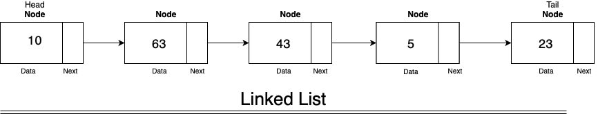

# Linked List
Linked List adalah Struktur Data yang terdiri dari suatu node dan referensi/pointer yang menghubungkan satu node dengan yang lain. Dimana Node terakhir memiliki referensi ke null (None). Setiap node memiliki data dan referensi ke node selanjutnya (singly) dan atau ke node sebelumnya (doubly).



## Dokumentasi
* [Node](#node)
* [LinkedList](#linkedlist)
    * [to_linked](#to_linked)
    * [append](#append)
    * [insert_start](#insert_start)
    * [insert_at](#insert_at)
    * [remove_at](#remove_at)

### Node
`node = Node(data,point)`

Create Node that alows to store two data in head and pointer.

#### Parameter       
* data: Values to be stored in head
* point: Values to be pointed

self.head = data
self.point = point
        
Example :
```python
>>> node = Node(5)
>>> node.point = Node(3)
>>> node
5-->3-->
```

### LinkedList
<strong id="to_linked">LinkedList().to_linked(array)</strong>

Convert normal python iterable into linked list
Example :

```python
>>> linked_list = LinkedList()
>>> linked_list.to_linked([1,2,3])
>>> linked_list
1-->2-->3-->
```

_Parameter_
* array: Iterable, ex : list, tuple, set

<strong id="append">LinkedList().append(data)</strong>

Append data values from any type into linked list.

Example:
```python
>>> linked_list = LinkedList()
>>> linked_list.to_linked([1,2,3])
>>> linked_list.append('Can be anything')
>>> linked_list
1-->2-->3-->Can be anything-->
```

_parameter_
* data: Values to be appended in any type.

<strong id="insert_start">LinkedList().insert_start(data)</strong>

Insert values to linked list at the start (index zero)

Example :
```python 
>>> linked_list = LinkedList()
>>> linked_list.to_linked([1, 2, 3])
>>> linked_list.insert_start(7)
>>> linked_list
7-->1-->2-->3-->
```

_parameter_
* data: Values to be appended

<strong id="insert_at">LinkedList().insert_at(index, data)</strong>

Insert values into specific index of linked list

Example :
```python
>>> linked_list = LinkedList()
>>> linked_list.to_linked([1, 2, 3])
>>> linked_list.insert_at(2,12)
>>> linked_list
1-->2-->12-->3-->
```

_parameter_
* index: Index / position of the linked list
* data: Values to be appended

<strong id="remove_at">LinkedList().remove_at(index)</strong>

Remove values from linked list by the index

Example :

```python
>>> linked_list = LinkedList()
>>> linked_list.to_linked([1, 2, 3])
>>> linked_list.remove_at(2)
>>> linked_list
1-->2-->
```

_parameter_
* index: Index of linked list
